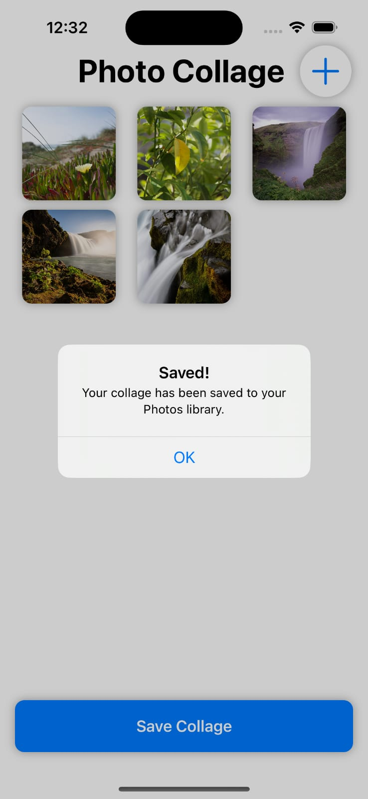
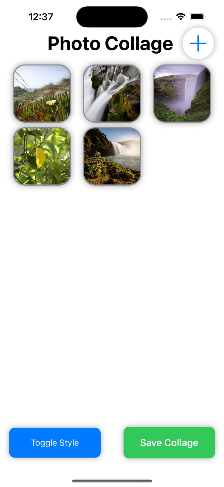
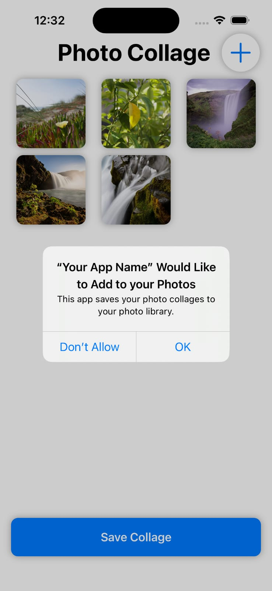
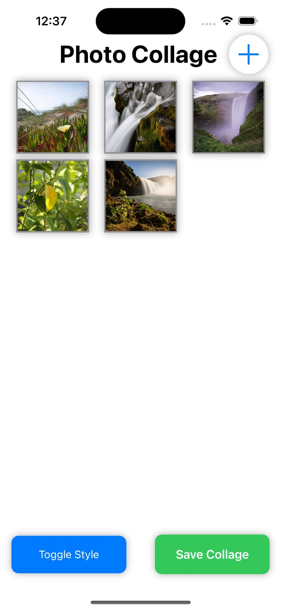
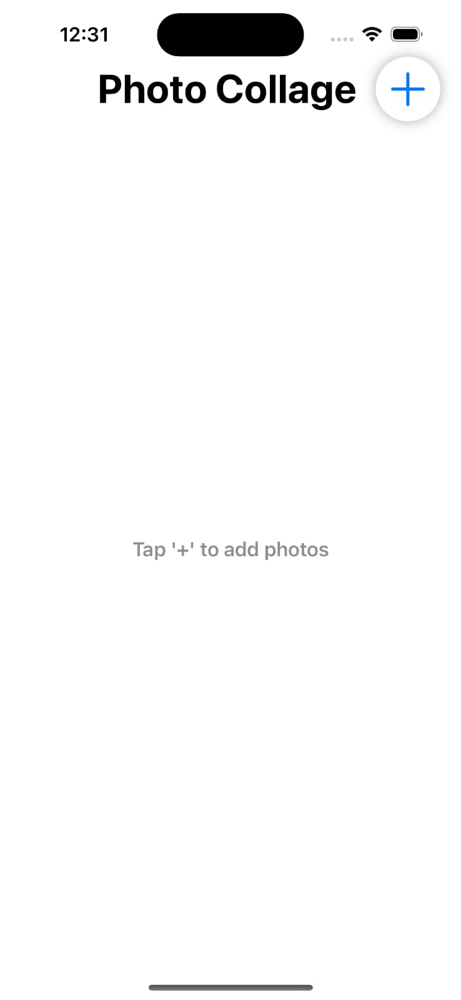
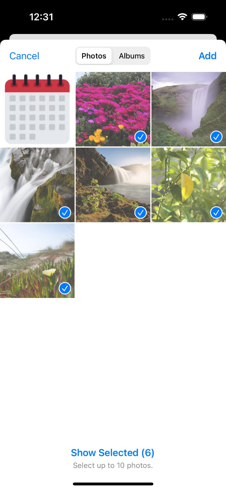
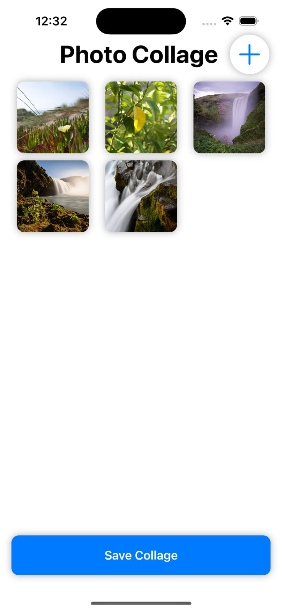

# Swift-assignment
Tasfia Zaman Samiha 

2007078

Welcome to the Photo Collage App! 🎨
Hey there! 👋 Thank you for checking out the Photo Collage App. This app is all about making it super simple (and fun!) to create your very own photo collages. No extra frills—just you, your photos, and some cool layouts. Here’s a quick guide to help you get started.
✨ What Can You Do With This App?

    Pick Your Favorites: Choose up to 10 photos from your gallery in just a few taps.
    Make a Collage: Your photos will be neatly arranged in a grid for you.
    Switch Styles: Want to mix it up? Tap a button to toggle between collage styles.
    Save It Forever: When you're happy with your masterpiece, save it directly to your photo library.

🚀 How To Get Started

    Open the App: Launch the app from your home screen. You’ll see a clean, empty space waiting for your creativity.

    Add Your Photos:
        Tap the big + icon in the corner.
        Your gallery will pop up—just tap on the photos you want.
        You can select up to 10 photos. Once you’re ready, hit Add.

    Create Your Collage:
        Once your photos are added, the app will automatically arrange them into a cool layout. No manual fuss!

    Customize Your Style:
        Not loving the first layout? Tap Toggle Style to explore different arrangements.
        Keep toggling until you find something you love.

    Save Your Collage:
        When you’re done, tap Save Collage at the bottom.
        The app might ask for permission to save to your Photos—just tap OK.
        A quick confirmation will let you know your collage is safe and sound in your photo library.

🛠️ Developer Notes

If you’re curious about how this works under the hood (or want to make your own version), here’s the techy bit:

    The app uses UIImagePickerController to let you pick photos from your gallery.
    Once you pick them, we use UICollectionView to display your images as a grid.
    When saving the collage, we combine all the photos into a single UIImage and save it with UIImageWriteToSavedPhotosAlbum.

🎉 Why You’ll Love It

This app is simple. No ads, no confusing features—just you and your photos. Whether you want to share memories on social media or keep them for yourself, this app makes it super easy to create something beautiful.

